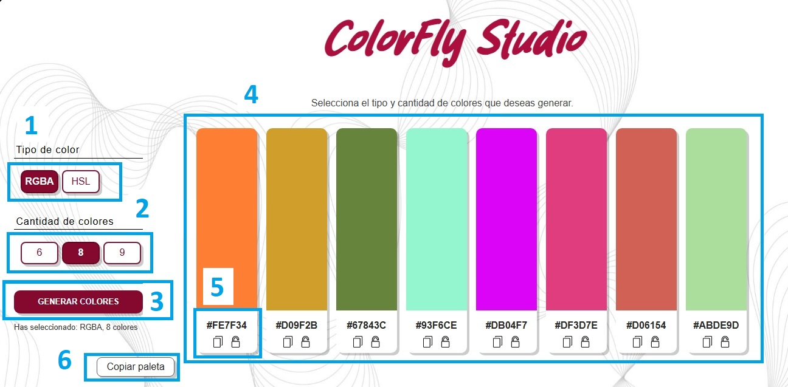

# Generador de Paletas de Colores Aleatorios


Esta es una aplicación web interactiva que permite generar paletas de colores aleatorias. Los usuarios pueden elegir el tamaño de la paleta y visualizar los colores en formato HEX.

## Instrucciones de uso - manual de usuario

### Funcionalidades principales

- **Tipo de color:** La app cuenta con dos tipos de colores a elegir, HSL y RGBA.
- **Cantidad de colores:** Podrás elegir entre 6, 8 o 9 colores para generar.
- **Visualización:** Verás los colores generados aleatoriamente con su respectivo código HEX, además la app cuenta con retroalimentación que te indicará qué tipo y cantidad has seleccionado y las acciones que realizas con el color como; copiarlo, bloquearlo y/o copiar la paleta entera.


### Flujo de la APP





- **Paso 1:** Seleccione el tipo de color entre RGBA Y HSL
- **Paso 2:** Seleccione la cantidad de colores que desea generar: 6, 8 o 9.
- **Paso 3:** Click en el botón "Generar colores" para que se generen los colores con las opciones marcadas anteriormente.
- **Paso 4:** En este bloque se visualizaran los colores generados.
- **Paso 5:** Bloque que contiene el código HEX del color + funcionalidades, copiar/bloquear color (en el localstorage)
- **Paso 6:** Boton para copiar paleta, la cual se copia en el localstorage.


## Decisiones Técnicas

1. ### Tecnologías Utilizadas

Para este proyecto, se eligieron tecnologías web estándar (html, css, js), lo que facilita su comprensión, desarrollo y despliegue en cualquier entorno web, se buscó trabajar por independiente cada tecnología y conectarlas dentro del mismo html. Estas son las principales tecnologías utilizadas:

#### HTML5
Se utilizó HTML5 para estructurar el contenido de la página web de manera semántica y accesible.
Las etiquetas semánticas como header, main, footer y button ayudan a mejorar la accesibilidad y la indetación de la página.

#### CSS
Se usaron estilos CSS para la parte visual de la aplicación, con un enfoque en la simplicidad y la claridad.<br>
Se utilizó Flexbox y Grid para la disposición y alineación de los elementos.<br>
Para mejorar la experiencia de usuario, se aplicaron transiciones suaves y efectos visuales como cambios de color al interactuar con los botones.<br>

#### JavaScript
Se utilizó JavaScript puro para crear un proyecto liviano, fácil de trabajar y adecuado para su uso como archivo local. <br> Además, se implementó la creación dinámica de elementos para que la interfaz se adapte fácilmente a la interacción entre el usuario y el código.<br>
Se utilizaron algunas funciones definidas, como por ejemplo Math.random() para generar los colores aleatorios, otras se construyeron a partir de la lógica y en base a los objetivos propuestos para el proyecto.

**Interactividad:**
Los usuarios pueden interactuar con los elementos de la interfaz (botones, colores) gracias a los manejadores de eventos (addEventListener).<br>
Se añadieron pequeños efectos visuales para el atractivo de la app (efecto tipo ruleta al generar los colores).<br>

**Microfeedback:**
Se puede visualizar las opciones marcadas para el tipo y cantidad de colores a generar.<br>
Además se implementaron las herramientas del toast para dar aviso cuando se genere una accion con el color (copiar/bloquear).<br>

#### Git / GitHub
Control de versiones: El proyecto fue versionado usando Git. Se utilizaron commits frecuentes para guardar los avances y tener un historial de cambios organizado.
GitHub Pages: La aplicación fue desplegada usando GitHub Pages, lo que permite alojar aplicaciones estáticas de manera sencilla y gratuita.

2. ### Estructura del proyecto
La estructura del repositorio se organizó de manera clara y modular para facilitar la legibilidad y mantenimiento del proyecto.<br>

```
/Desarrollo
├── /css/                        # Carpeta para los archivos de estilos CSS<br>
│  ├── normalize.css             # Archivo CSS para normalizar estilos en diferentes navegadores<br>
│  └── styles.css                # Archivo principal de estilos personalizados<br>
│
├── /fonts/                       # Carpeta para fuentes personalizadas
│   └── Rolling Cake.otf          # Fuente personalizada utilizada en el proyecto
│
├── /iconos/                      # Carpeta para los iconos de la aplicación
│   ├── candado-abierto.png       # Icono de candado abierto
│   ├── cerrar-con-llave.png      # Icono de cerrar con llave
│   └── copiar.png                # Icono para copiar el código HEX
│
├── /img/                         # Carpeta para imágenes (fondos, diagramas, etc.)
│   └── fondo.jpg                 # Imagen de fondo de la página
│
├── /js/                          # Carpeta para los scripts de JavaScript
│   └── scripts.js                # Archivo de JavaScript que contiene la lógica de la aplicación
│
├── /Documentacion/               # Carpeta para la documentación del proyecto
│   └── flujo-principal.jpg       # Diagrama o flujo principal de la aplicación
│
├── README.md                     # Archivo de documentación principal del proyecto
└── index.html                    # Archivo HTML que carga la aplicación web
```
## Pasos para Descargar y Ejecutar la Aplicación de Forma Local
### Requisitos Previos:
Tener Git instalado: Si no tienes Git, puedes descargarlo desde aquí.<br>
Editor de código recomendado: Usar un editor como VSCode para trabajar de manera cómoda, aunque también puedes usar cualquier otro editor de tu preferencia.<br>

### Instrucciones para Descargar y Ejecutar Localmente:
**Paso 1:** Descargar el Repositorio como ZIP<br>
1. Accede al repositorio en GitHub: <br>
- Ingresa al repositorio en GitHub a través del siguiente link: https://github.com/1LuciaLemes/ProyectoM1_LuciaLemes.<br>
2. Descargar el proyecto:
- Haz clic en el botón verde "<> Code" que aparece en la parte superior de tu repositorio.
- En el menú desplegable, selecciona "Download ZIP". Esto descargará el proyecto en formato comprimido (ZIP) a tu computadora.


**Paso 2:** Extraer los Archivos del Proyecto
- Extraer el archivo ZIP:
- Una vez descargado el archivo, ve a la carpeta donde se guardó el archivo ZIP (normalmente en la carpeta de Descargas).
- Haz clic derecho sobre el archivo ZIP y selecciona "Extraer todo...".<br>
- Elige la ubicación donde deseas extraer el contenido y presiona "Extraer".<br>


**Paso 3:** Abrir el Proyecto en un Editor de Código
- Abrir en un editor de código:
Abre el archivo index.html del proyecto extraído en un editor de código como VSCode o cualquier otro de tu preferencia.
- Si usas VSCode, puedes hacer clic derecho sobre el archivo index.html y seleccionar "Abrir con Code" (si tienes VSCode instalado).
- Sino cuentas con ninguno de estos programas aquí puedes descargar VScode: https://code.visualstudio.com/download.


**Paso 4:** Ejecutar el Proyecto Localmente
- Para lograr esto, primero debes abrir la carpeta que descomprimiste en el VSCode:<br>
Esto se logra yendo a File arriba a la derecha, luego Open folder y seleccionar la carpeta llamada PROYECTO_INTEGRADOR (en este caso).<br>
- Abrir el archivo en tu navegador:<br>
Una vez que tengas el proyecto abierto en tu editor de código, simplemente haz doble clic en el archivo index.html para abrirlo en tu navegador predeterminado.
Verás la aplicación funcionando localmente.


**Paso 5:** Usar Live Server (Opcional)

Si prefieres que el navegador se actualice automáticamente cada vez que realices un cambio en el código, puedes usar la extensión Live Server en VSCode:

- Abre el proyecto en VSCode.
- Instala la extensión Live Server desde el marketplace de VSCode.
- Haz clic derecho en el archivo index.html y selecciona "Open with Live Server".
- Esto abrirá una versión local de la aplicación en tu navegador y reflejará los cambios en tiempo real a medida que edites el código.


## Pasos para Desplegar la Aplicación 

### Desplegar en GitHub Pages:
1. Crear un Repositorio en GitHub (si aún no lo has hecho):
- Si no tienes un repositorio en GitHub para tu proyecto, crea uno.
- Ve a tu cuenta de GitHub y haz clic en el botón verde "New" para crear un nuevo repositorio.

2. Subir el Proyecto a GitHub:
Si ya tienes tu proyecto en tu máquina local (y no lo has subido a GitHub), puedes hacerlo de la siguiente manera:

- Abre tu terminal y navega hasta la carpeta donde tienes el proyecto.
- Inicializa un repositorio Git, de la siguiente manera, en la terminal de gitBush (dentro de VSC) pon:<br>
git init<br>
**Añade los archivos al repositorio:**<br>
git add . <br>
**Haz un commit inicial:**<br>
git commit -m "Primer commit"<br>
**Añade el repositorio remoto (puedes copiar la URL desde tu repositorio de GitHub):**<br>
git remote add origin https://github.com/tu-usuario/tu-repositorio.git<br>
**Empuja los cambios a GitHub:**<br>
git push -u origin master<br>


3. Configurar GitHub Pages:
- Dirígete al repositorio en GitHub.
- En la página principal del repositorio, haz clic en "Settings".
- Desplázate hacia abajo hasta la sección GitHub Pages.
- En el menú desplegable Source, selecciona la rama master o main, dependiendo de cómo esté configurado tu repositorio.
- Haz clic en Save.


4. Obtener la URL de GitHub Pages:
- Después de habilitar GitHub Pages, GitHub proporcionará una URL pública donde tu aplicación estará disponible.
- La URL generalmente tendrá el siguiente formato: https://tu-usuario.github.io/tu-repositorio/.


5. Acceder a la Aplicación Desplegada:
- Visita la URL proporcionada por GitHub Pages en tu navegador para ver tu aplicación en línea, en este caso, la URL es:
https://1lucialemes.github.io/ProyectoM1_LuciaLemes/.